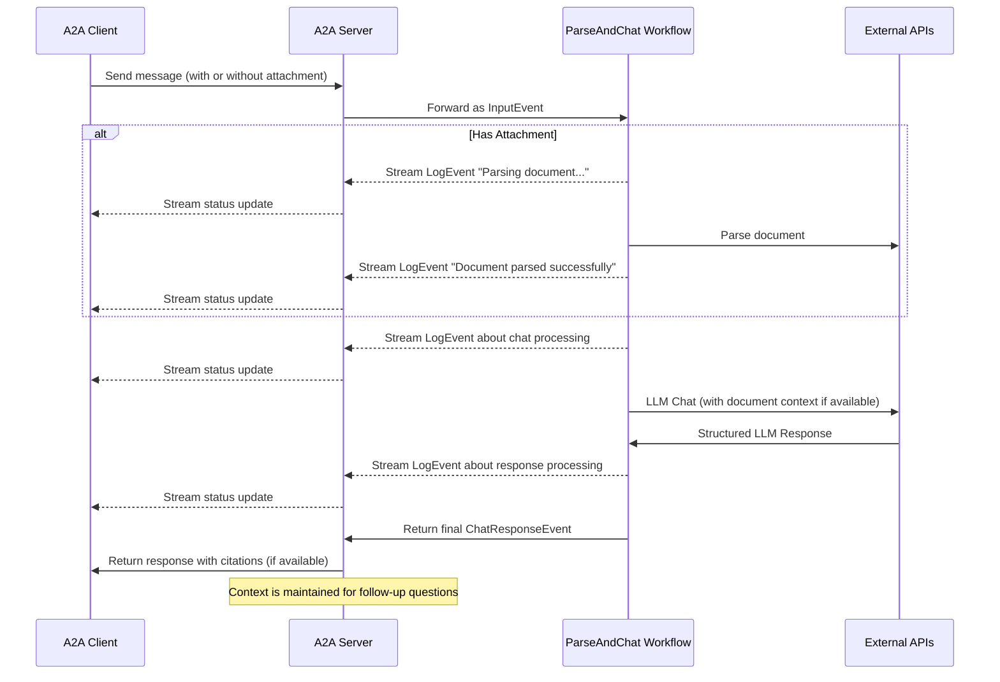

# Workspace Rules for google/A2A

## 1. 通用指南 (General Guidelines)

*   **語言 (Language):** 請務必使用繁體中文回覆。
    *   *範例:* 所有提交的程式碼註解、文件、提交訊息等均需使用繁體中文。
*   **編碼 (Encoding):** 對繁體中文友好，輸入、輸出文字檔時盡可能採用 `encoding="utf-8"`。
    *   *範例:* `with open('data.txt', 'w', encoding='utf-8') as f:`

## 2. 程式碼風格 (Code Style)

*   **簡潔性 (Conciseness):** 使用簡潔的程式碼風格實現要求的功能。
    *   *範例:* 避免冗餘的程式碼，優先使用清晰直接的表達方式。
*   **註解 (Comments):** 文件和函數注釋控制在一行以內。
    *   *範例:* `def calculate_sum(a, b): # 計算兩個數字的和`

## 3. 設定管理 (Configuration Management)

*   **變數定義 (Variable Definition):** 所有變數由統一配置文件管理，不能重複定義。
    *   *範例:* 將 API 金鑰、資料庫路徑等設定值存放在 `config.ini` 或 `settings.py` 中，程式碼中引用這些設定。

## 4. 變更管理 (Change Management)

*   **影響評估 (Impact Assessment):** 修改程式碼前必須檢查所有與之相關的功能不受影響或同步更新。
    *   *範例:* 修改核心函式前，執行相關的單元測試，確保其他模組調用不受影響。
*   **範圍控制 (Scope Control):** 除了明確要求全面優化之外，不要修改任何與要求無關的程式碼。
    *   *範例:* 若任務是修復特定錯誤，則只修改與該錯誤直接相關的程式碼。

## 5. 文件更新 (Documentation Updates)

*   **README 更新 (README Updates):** 任何新功能或影響原有操作的修改，都在 `README.md` 中合適的位置同步更新說明和使用方法 (插入 "## 使用範例(功能導向，讓大模型自動調用相關工具來求解)、## 授權" 前)。
    *   *範例:* 新增 API 端點後，在 `README.md` 的 API 說明部分加入新的端點描述和使用範例。

## 6. 效能與安全 (Performance & Security)

*   **效能優化 (Performance Optimization):** 任何程式碼的修改考慮並保證效率和性能的優化。
    *   *範例:* 對於耗時操作，考慮使用非同步處理或快取機制。
*   **安全考量 (Security Considerations):** 程式碼的錯誤、漏洞、安全性問題等都必須在程式碼中註明並且盡可能避免。
    *   *範例:* `# TODO: 驗證使用者輸入，防止 SQL 注入攻擊`

## 7. 基本程式碼架構 (Basic Code Structure)

以下是一個使用 TypeScript 實現 A2A 伺服器的基本架構範例：

```typescript
import {
  A2AServer,
  InMemoryTaskStore,
  TaskContext,
  TaskYieldUpdate,
} from "./index"; // Assuming imports from the server package

// 1. Define your agent's logic as a TaskHandler
async function* myAgentLogic(
  context: TaskContext
): AsyncGenerator<TaskYieldUpdate> {
  console.log(`Handling task: ${context.task.id}`);
  yield {
    state: "working",
    message: { role: "agent", parts: [{ text: "Processing..." }] },
  };

  // Simulate work...
  await new Promise((resolve) => setTimeout(resolve, 1000));

  if (context.isCancelled()) {
    console.log("Task cancelled!");
    yield { state: "canceled" };
    return;
  }

  // Yield an artifact
  yield {
    name: "result.txt",
    mimeType: "text/plain",
    parts: [{ text: `Task ${context.task.id} completed.` }],
  };

  // Yield final status
  yield {
    state: "completed",
    message: { role: "agent", parts: [{ text: "Done!" }] },
  };
}

// 2. Create and start the server
const store = new InMemoryTaskStore(); // Or new FileStore()
const server = new A2AServer(myAgentLogic, { taskStore: store });

server.start(); // Starts listening on default port 41241

console.log("A2A Server started.");
```
*來源: [samples/js/src/server/README.md](https://github.com/google/a2a/blob/main/samples/js/src/server/README.md#2025-04-21_snippet_0)*

## 8. 範例 (Examples)

### 8.1 TypeScript Client 使用範例

```typescript
import { A2AClient, Task, TaskQueryParams, TaskSendParams } from "./client"; // Import necessary types
import { v4 as uuidv4 } from "uuid"; // Example for generating task IDs

const client = new A2AClient("http://localhost:41241"); // Replace with your server URL

async function run() {
  try {
    // Send a simple task (pass only params)
    const taskId = uuidv4();
    const sendParams: TaskSendParams = {
      id: taskId,
      message: { role: "user", parts: [{ text: "Hello, agent!", type: "text" }] },
    };
    // Method now returns Task | null directly
    const taskResult: Task | null = await client.sendTask(sendParams);
    console.log("Send Task Result:", taskResult);

    // Get task status (pass only params)
    const getParams: TaskQueryParams = { id: taskId };
    // Method now returns Task | null directly
    const getTaskResult: Task | null = await client.getTask(getParams);
    console.log("Get Task Result:", getTaskResult);
  } catch (error) {
    console.error("A2A Client Error:", error);
  }
}

run();
```
*來源: [samples/js/src/client/README.md](https://github.com/google/a2a/blob/main/samples/js/src/client/README.md#2025-04-21_snippet_0)*

### 8.2 JSON 同步請求/回應範例 (Synchronous Request/Response)

**請求 (Request):**
```json
{
  "jsonrpc": "2.0",
  "id": 11,
  "method": "tasks/send",
  "params": {
    "id": "129",
    "sessionId": "8f01f3d172cd4396a0e535ae8aec6687",
    "acceptedOutputModes": [
      "text"
    ],
    "message": {
      "role": "user",
      "parts": [
        {
          "type": "text",
          "text": "How much is the exchange rate for 1 USD to INR?"
        }
      ]
    }
  }
}
```

**回應 (Response):**
```json
{
  "jsonrpc": "2.0",
  "id": 11,
  "result": {
    "id": "129",
    "status": {
      "state": "completed",
      "timestamp": "2025-04-02T16:53:29.301828"
    },
    "artifacts": [
      {
        "parts": [
          {
            "type": "text",
            "text": "The exchange rate for 1 USD to INR is 85.49."
          }
        ],
        "index": 0
      }
    ],
    "history": []
  }
}
```
*來源: [samples/python/agents/langgraph/README.md](https://github.com/google/a2a/blob/main/samples/python/agents/langgraph/README.md#2025-04-21_snippet_2)*

### 8.3 JSON 串流請求/回應範例 (Streaming Request/Response)

**請求 (Request):**
```json
{
  "jsonrpc": "2.0",
  "id": 12,
  "method": "tasks/sendSubscribe",
  "params": {
    "id": "131",
    "sessionId": "cebd704d0ddd4e8aa646aeb123d60614",
    "acceptedOutputModes": [
      "text"
    ],
    "message": {
      "role": "user",
      "parts": [
        {
          "type": "text",
          "text": "How much is 100 USD in GBP?"
        }
      ]
    }
  }
}
```

**回應串流 (Response Stream):**
```json
data: {"jsonrpc":"2.0","id":12,"result":{"id":"131","status":{"state":"working","message":{"role":"agent","parts":[{"type":"text","text":"Looking up the exchange rates..."}]},"timestamp":"2025-04-02T16:59:34.578939"},"final":false}}

data: {"jsonrpc":"2.0","id":12,"result":{"id":"131","status":{"state":"working","message":{"role":"agent","parts":[{"type":"text","text":"Processing the exchange rates.."}]},"timestamp":"2025-04-02T16:59:34.737052"},"final":false}}

data: {"jsonrpc":"2.0","id":12,"result":{"id":"131","artifact":{"parts":[{"type":"text","text":"Based on the current exchange rate, 1 USD is equivalent to 0.77252 GBP. Therefore, 100 USD would be approximately 77.252 GBP."}],"index":0,"append":false}}}

data: {"jsonrpc":"2.0","id":12,"result":{"id":"131","status":{"state":"completed","timestamp":"2025-04-02T16:59:35.331844"},"final":true}}
```
*來源: [samples/python/agents/langgraph/README.md](https://github.com/google/a2a/blob/main/samples/python/agents/langgraph/README.md#2025-04-21_snippet_4)*

### 8.4 Mermaid 流程圖範例 (Sequence Diagram Example)


*來源: [samples/python/agents/llama_index_file_chat/README.md](https://github.com/google/a2a/blob/main/samples/python/agents/llama_index_file_chat/README.md#2025-04-21_snippet_0)*
